### **Задание 1.** Установите Zabbix Server с веб\-интерфейсом. 

|  sudo apt install postgresql wget [https://repo.zabbix.com/zabbix/6.0/debian/pool/main/z/zabbix-release/zabbix-release\_latest\_6.0+debian13\_all.deb](https://repo.zabbix.com/zabbix/6.0/debian/pool/main/z/zabbix-release/zabbix-release_latest_6.0+debian13_all.deb)  sudo dpkg \-i zabbix-release\_latest\_6.0+debian13\_all.deb sudo apt install zabbix-server-pgsql zabbix-frontend-php php8.4-pgsql zabbix-apache-conf zabbix-sql-scripts nano \-y sudo \-u postgres createuser \--pwprompt zabbix sudo \-u postgres createdb \-O zabbix zabbix sudo systemctl start zabbix-server.service sudo systemctl enable zabbix-server.service zcat /usr/share/zabbix-sql-scripts/postgresql/server.sql.gz | sudo \-u zabbix psql zabbix sudo find / \-name zabbix\_server.conf sudo apt install zabbix-agent |
| :---- |

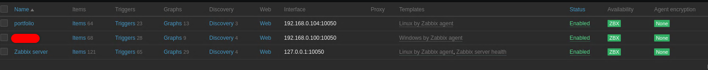
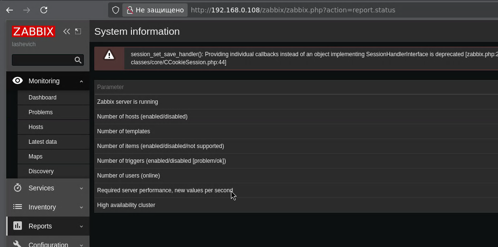

### **Задание 2\.** Установите Zabbix Agent на два хоста

### 

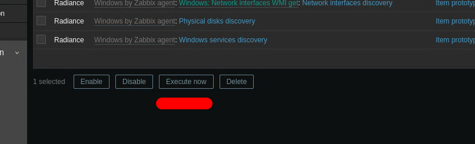
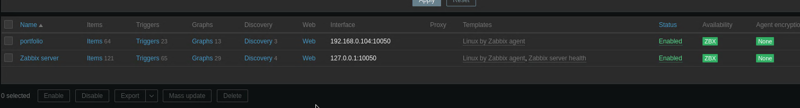
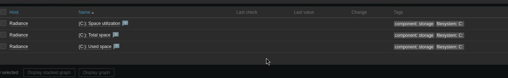
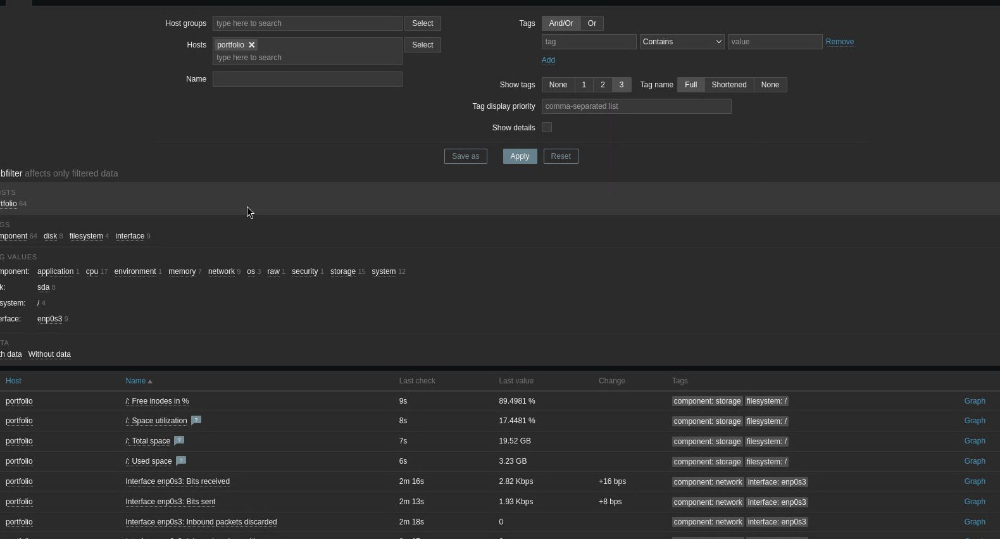

### **Задание 3\.** Установите Zabbix Agent на Windows (компьютер) и подключите его к серверу Zabbix. 

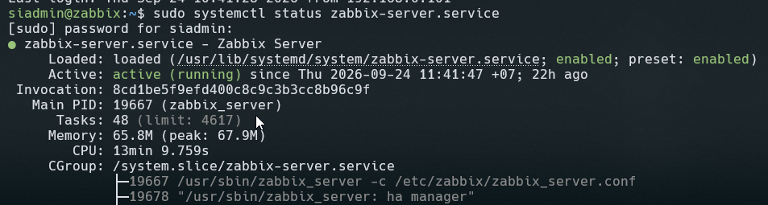
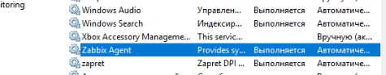
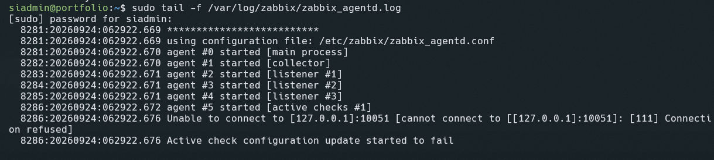
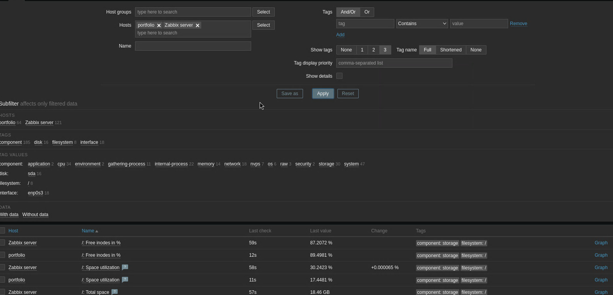
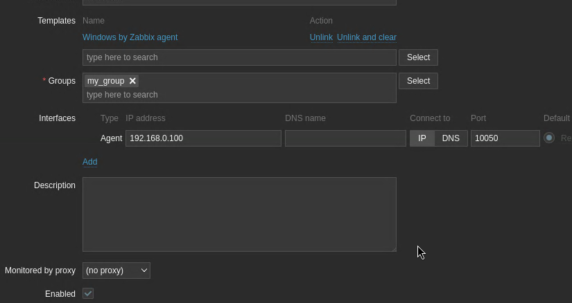

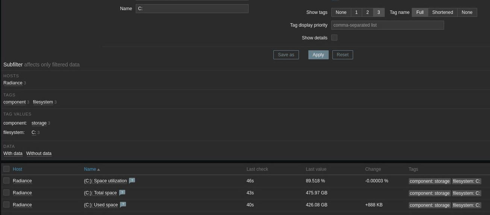
